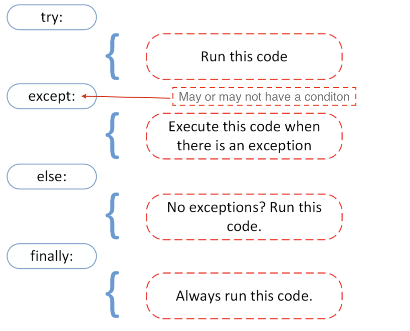
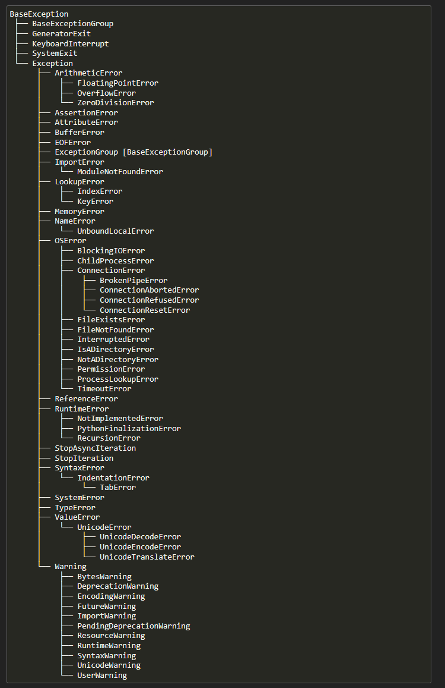

# Excepciones en Python

Python Usa las excepciones para manejar los errores de fomra satisfactoria. Es una forma de controlar el comportamiento de un programa cuando se produce un error. Esto es muy importante ya que salvo que tratemos ese error , **el programa se parara**.



Imaginemos que tenemos el siguiente codigo:

```python
a=4
b=2
c=a/b
```

Pero imaginemos ahora que por cualquier motivo las variables tienen otro valor, y que por ejemplo `b` tiene el valor de `0`. Si intetamos hacer a division entre cero, el
programa dara un error y su ejecucion terminara de manera abrupta

```python
a = 4; b = 0
print(a/b)
# ZeroDivisionError: division by zero
```

Este error es lanzado por `Python` (RAISE) en ingles ya que la division entre cero es una operacion que matematicamente no esta definida

Se trata de la excepcion `ZeroDivisionError`. en este **enlace** [Built In Exceptions](https://docs.python.org/3/library/exceptions.html) van a poder ver todos los tipos de excepciones que existen:



En base a esto es **muy importante controlar las excepciones** , porque por muchas comprobaciones que realicemos es posible que en algún momento ocurra una, y si no se hace nada el programa se parará.

## Uso de raise

También podemos ser nosotros los que levantemos o lancemos una excepción. Volviendo a los ejemplos usados en el apartado anterior, podemos ser nosotros los que levantemos `ZeroDivisionError` o `NameError` usando `raise`. La sintaxis es muy fácil.

```python
raise ZeroDivisionError("Información de la excepción")
```

> O Cualquier excepcion que deseemos lanzar

## Uso de try y except

El uso de Try y Except nos va a permitir **capturar estas excepciones** y manejarlas adecuadamente (sin que el programa se detenga)

```python
a = 5; b = 0
try:
    c = a/b
except ZeroDivisionError:
    print("No se ha podido realizar la división")
```

Lo que hay dentro del `try` es la sección del código que podría lanzar la excepción que se está capturando en el `except`. Por lo tanto cuando ocurra una excepción, se entra en el except pero el programa no se para.

También se puede capturar diferentes excepciones como se ve en el siguiente ejemplo.

```python
try:
    #c = 5/0       # Si comentas esto entra en TypeError
    d = 2 + "Hola" # Si comentas esto entra en ZeroDivisionError
except ZeroDivisionError:
    print("No se puede dividir entre cero!")
except TypeError:
    print("Problema de tipos!")
```

##  Uso de finally

Este bloque se ejecuta siempre, haya o no haya habido excepción.

> Se suele usar si queremos ejecutar algún tipo de acción de limpieza. Si por ejemplo estamos escribiendo datos en un fichero pero ocurre una excepción, tal vez queramos borrar el contenido que hemos escrito con anterioridad, para no dejar datos inconsistenes en el fichero.

```python
try:
    # Forzamos excepción
    x = 2/0
except:
    # Se entra ya que ha habido una excepción
    print("Entra en except, ha ocurrido una excepción")
finally:
    # También entra porque finally es ejecutado siempre
    print("Entra en finally, se ejecuta el bloque finally")

#Entra en except, ha ocurrido una excepción
#Entra en finally, se ejecuta el bloque final
```

### Usando Excepciones

```python
# Creando Excepciones personalizadas

class MiError(Exception):
#* Esta clase es para representar mi error

    def __init__ (self,mensaje,codigo):
        self.mensaje = mensaje
        self.codigo = codigo
            
    def __str__(self):
        return f"{self.mensaje} - codigo: {self.codigo}"

# try:
#     n1 = int(input("Escribe el primer numero: "))
#     n1 = int(input("Escribe el segundo numero: "))

# #* TIPOS DE EXCEPCIONES
# except ValueError as e: 
#     print("Ingresa una valor que corresponda") # PODEMOS PRINTEAR LA EXCEPCION EN ESPECIFICO ES DECIR (ValueError) en este caso PARA OBTENER EL VALOR CONCRETO Y DESPUES LE PASAMOS ESA EXCEPCION ESPECIFICA
# finally:
#     print('se ejecuta siempre') # Lo vamos a usar independientemente si vamos a tener exito en un bloque de try/catch
     
#* Lanzando excepciones 

def division(n=0):
    if n == 0:
        raise MiError('No se puede dividir por 0' , 777)
    return 5/n

try:
    division()
except MiError as e:
    print(e)

```
