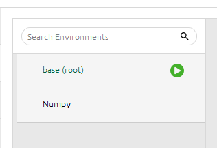

# Numpy

Numpy es una libreria de python que permite trabajar con **arreglos multidimensionales y matrices**, ademas de proveer una gran cantidad de funciones matematicas para operar con estos arreglos.

En el nucleo del paquete Numpy se encuentra el objeto **ndarray** que es un arreglo multidimensional de elementos del mismo tipo. Los arreglos de Numpy son mas eficientes que las listas de python, ya que permiten realizar operaciones **vectorizadas** (se aplican todas las operaciones a todos los elementos del arreglo al mismo tiempo) y son mas rapidos en cuanto a tiempo de ejecucion.

> En resumen, Numpy es una libreria que permite trabajar con arreglos multidimensionales y matrices de manera eficiente y rapida, ademas de proveer una gran cantidad de funciones matematicas para operar con estos arreglos. Permite realizar operaciones vectorizadas y es mas eficiente que las listas de python.

## Diferencias entre listas de python y arreglos de Numpy

- Las matrices Numpy tienen un **tamaño fijo**, mientras que las listas de python pueden cambiar de tamaño dinamicamente.
- Los arreglos de Numpy son **homogeneos**, es decir, todos los **elementos** del arreglo deben ser del **mismo tipo**, mientras que las listas de python pueden contener elementos de diferentes tipos.
- Facilitan los aspectos **matematicos avanzados**, ya que permiten realizar operaciones vectorizadas y son mas rapidos en cuanto a tiempo de ejecucion.

## Instalacion

El método recomendado de instalación de NumPy depende de su flujo de trabajo preferido. A continuación, desglosamos los métodos de instalación en las siguientes categorías:

### Instalación con Anaconda

Descargué Anaconda desde el sitio oficial: [https://www.anaconda.com/download](https://www.anaconda.com/download)

Una vez instalado, abrí **Anaconda Navigator** (la interfaz gráfica) y desde la pestaña **Environments** creé un nuevo entorno, agregando NumPy directamente desde ahí.



Desde el Home, seleccionamos el entorno que acabamos de crear


Con el entorno ya creado y activo, lancé **Jupyter Notebook** desde el propio Navigator, haciendo clic en el botón "Launch" correspondiente a Jupyter dentro de ese entorno.


De esta forma, Jupyter se ejecuta dentro del entorno que ya tiene NumPy instalado, evitando conflictos con otras versiones de paquetes.

## Atributos de un arreglo Numpy

- **ndim**: Devuelve el **número** de *dimensiones del arreglo*.
- **shape**: Devuelve una **tupla** con las *dimensiones del arreglo*.
- **size**: Devuelve el **número total** de *elementos del arreglo*.
- **dtype**: Devuelve el **tipo de dato** del arreglo.
- **itemsize**: Devuelve el **tamaño en bytes** de cada elemento del arreglo.
- **data**: Devuelve un objeto buffer que contiene los datos del arreglo.

```python
>>> import numpy as np
>>> a = np.arange(15).reshape(3, 5)
>>> a
array([[ 0,  1,  2,  3,  4],
       [ 5,  6,  7,  8,  9],
       [10, 11, 12, 13, 14]])
>>> a.shape
(3, 5)
>>> a.ndim
2
>>> a.dtype.name
'int64'
>>> a.itemsize
8
>>> a.size
15
>>> type(a)
<class 'numpy.ndarray'>
>>> b = np.array([6, 7, 8])
>>> b
array([6, 7, 8])
>>> type(b)
<class 'numpy.ndarray'>
```
