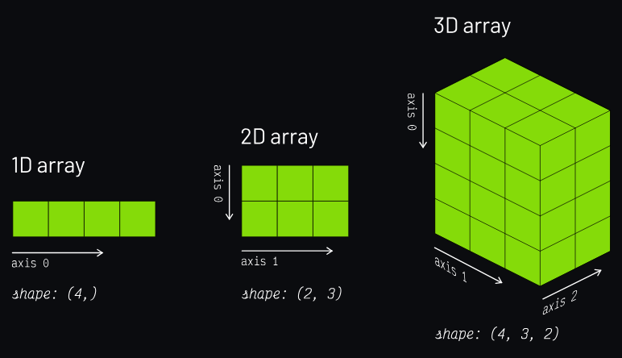

# Manipulacion de elementos

Los arrays multidimensionales de NumPy están indexados por unos ejes que establecen la forma en la que debemos acceder a sus elementos. Véase el siguiente diagrama:



## Arrays de una dimensión

Pasrtimos del siguiente arrray unidimensional:

```python
>>>values = np.array(range(10, 16))
>>> values
##array([10, 11, 12, 13, 14, 15])
```

### Acceso

```python
>>> values[2]
## 12
>>> values[-3]
## 13
```

### Modificación

```python
>>> values[0] = values[1] + values[5] #26
>>> values
##array([26, 11, 12, 13, 14, 15])
```

### Borrado

```python
>>> np.delete(values, 2)
# array([26, 11, 13, 14, 15])
>>> np.delete(values, (2, 3, 4))
# array([26, 11, 15])
```

### Insertar

```python
>>> np.append(values, 16) # Insertar al final
# array([26, 11, 12, 13, 14, 15, 16])
>>> np.insert(values, 1, 101) # Insertar en la posición 1
# array([26, 101, 11, 12, 13, 14, 15])
```

## Arrays  Multidimensionales

Partimos del siguiente array bidimensional:

```python
>>> values = np.arange(1, 13).reshape(3, 4)
>>> values
array([[ 1,  2,  3,  4],
       [ 5,  6,  7,  8],
       [ 9, 10, 11, 12]])
```

### Acceso

```python
>>> values[1, 2] # Elemento de la fila 1 y columna 2
## 7
>>> values[-1, -1] # Elemento de la última fila y última columna
## 12
>>> values[1, 2] # Elemento de la fila 1 y columna 2
## 7
```

### Modificación

```python
>>> values
#array([[ 1,  2,  3,  4],
#       [ 5,  6,  7,  8],
#       [ 9, 10, 11, 12]])
>>> values[0, 0] = 100 # Reemplaza el elemento de la fila 0 y columna 0

>>> values[1] = [55, 66, 77, 88] # Reemplaza la fila 1

>>> values[:,2] = [30, 70, 110] # Reemplaza la columna 2

>>> values
#array([[100,   2,  30,   4],
#       [ 55,  66,  70,  88],
#       [  9,  10, 110,  12]])
```

### Borrado

```python
>>> values
#array([[ 1,  2,  3,  4],
#       [ 5,  6,  7,  8],
#       [ 9, 10, 11, 12]])
>>> np.delete(values, 0, axis=0) # Axis=0 hace referencia a las filas

#array([[ 5,  6,  7,  8],
#       [ 9, 10, 11, 12]])

>>> np.delete(values, (1, 3), axis=1) # Axis=1 hace referencia a las columnas (borramos la columna 1 y 3)
#array([[ 1,  3],
#       [ 5,  7],
#       [ 9, 11]])

```

### Insertar

```python
>>> values
# array([
#[1,2],
#[3,4],
# ]),
>>> np.append(values, [[5, 6]], axis=0) # Insertamos una fila al final
# array([
#[1,2],
#[3,4],
#[5,6]
# ]),
>>> np.append(values, [[5], [6]], axis=1) # Insertamos una columna al final
# array([
#[1,2,5],
#[3,4,6],
# ]),
```

Insertar elementos en posiciones arbitrarias del array:

```python
>>> values
# array([
#[1,2],
#[3,4],
# ]),
>>> np.insert(values, 1, [[5, 6]], axis=0) # Insertamos una fila en la posición 1
# array([
#[1,2],
#[5,6],
#[3,4],
# ]),
>>> np.insert(values, 1, [[5], [6]], axis=1) # Insertamos una columna en la posición 1
# array([
#[1,5,2],
#[3,6,4],
# ]),
```

## Apilando Matrices

Hay ocasiones en las que nos interesa combinar dos matrices (arrays en general). Una de los mecanismos que nos proporciona NumPy es el apilado:

### Apilado Vertical

```python
>>> m1 = np.random.randint(1, 100, size=(3, 2))
>>> m2 = np.random.randint(1, 100, size=(1, 2))

>>> m1
#array([[ 5, 23],
#       [12, 34],
#       [45, 67]])
>>> m2 
# array([[89, 90]])
>>>

np.vstack((m1, m2))
#array([[ 5, 23],
#       [12, 34],
#       [45, 67]]) 
#      [89, 90]])
```

### Apilado Horizontal

```python
>>> m1 = np.random.randint(1, 100, size=(3, 2))
>>> m2 = np.random.randint(1, 100, size=(1, 2))

>>> m1
#array([[ 5, 23],
#       [12, 34],
#       [45, 67]])
>>> m2 
# array([
# [89],
# [90],
# [91]
#])
>>>

np.hstack((m1, m2))
#array([[ 5, 23, 89],
#       [12, 34, 90],
#       [45, 67, 91]])
```

## Repitiendo Elementos
El parámetro de repetición indica el número de veces que repetimos el array completo por cada eje:

### Repeticion por Ejes
```python
>>> values
# array([
#[1,2],
#[3,4],
#[5,6]])

>>> np.tile(values, 3) # Repetimos cada array completo 3 veces
# array([
#[1,2,1,2,1,2],
#[3,4,3,4,3,4],
#[5,6,5,6,5,6] ])

>>> np.tile(values, (2, 3)) # Repetimos el array completo 2 veces por el eje 0 (fila)y 3 veces por el eje 1 (columna)
# array([
#[1,2,1,2,1,2],
#[3,4,3,4,3,4],
#[5,6,5,6,5,6],
#[1,2,1,2,1,2],
#[3,4,3,4,3,4],
#[5,6,5,6,5,6]
# ])
```

### Repeticion por elementos

```python
>>> values
# array([
#[1,2],
#[3,4],
#[5,6]])
>>> np.repeat(values, 2) # Repetimos cada elemento 2 veces
# array([
#[1,2,1,2],
#[3,4,3,4],
#[5,6,5,6]])
>>> np.repeat(values, 2, axis=0) # Repetimos cada fila 2 veces
# array([
#[1,2],
#[3,4], 
#[5,6],
#[1,2],
#[3,4],
#[5,6]])
>>> np.repeat(values, 3, axis=1) # Repetimos cada columna 3 veces
# array([
#[1,1,1,2,2,2],
#[3,3,3,4,4,4],
#[5,5,5,6,6,6]])
```

## Acceso por Diagonal

El "acceso por diagonal" se refiere a las formas en que NumPy te permite leer, extraer o modificar los elementos que están en la diagonal principal (o diagonales secundarias) de una matriz, sin necesidad de recorrerla con bucles.

### Las 4 herramientas principales

1. ``np.diagonal()`` — Extraer la diagonal (solo lectura por defecto)

```python
import numpy as np

m = np.array([[1, 2, 3],
              [4, 5, 6],
              [7, 8, 9]])

diag = np.diagonal(m)
print(diag)  # [1 5 9]
```

> Por defecto es un view de solo lectura (en NumPy moderno), así que si intentás modificarla directamente puede dar error o comportamiento no garantizado. Para editar, usá el método de abajo.

2. ``np.fill_diagonal()`` — Rellenar la diagonal de una matriz con un valor específico

```python
m = np.array([[1, 2, 3],
              [4, 5, 6],
              [7, 8, 9]])

np.fill_diagonal(m, 0)
print(m)
# [[0 2 3]
#  [4 0 6]
#  [7 8 0]]
```

> Cuándo usarlo: cuando necesitás anular la diagonal (por ejemplo, en una matriz de similitud donde no querés que un elemento se compare consigo mismo).

3. ``np.diag()`` — Crear una matriz diagonal a partir de un vector o extraer la diagonal de una matriz

```python
# Caso A: si le das una matriz 2D -> extrae la diagonal
m = np.array([[1, 2], [3, 4]])
print(np.diag(m))  # [1 4]

# Caso B: si le das un vector 1D -> construye una matriz diagonal
v = np.array([1, 2, 3])
print(np.diag(v))
# [[1 0 0]
#  [0 2 0]
#  [0 0 3]]
```

> Cuándo usarlo: el Caso B es muy usado para crear matrices de escalado o pesos diagonales rápidamente.

4. ``np.trace()`` — Calcular la suma de los elementos de la diagonal principal

```python
m = np.array([[1, 2, 3],
              [4, 5, 6],
              [7, 8, 9]])

print(np.trace(m))  # 15  (1+5+9)
```

> Cuándo usarlo: la traza aparece en cálculos de varianza total (en PCA), en la fórmula de algunas métricas de regularización, y en teoría de grafos.

## Diagonales que no son la "principal"

Todas estas funciones aceptan el parámetro ``offset`` para desplazarte a diagonales superiores o inferiores:

```python
m = np.array([[1, 2, 3],
              [4, 5, 6],
              [7, 8, 9]])

print(np.diagonal(m, offset=1))   # [2 6]  -> diagonal superior
print(np.diagonal(m, offset=-1))  # [4 8]  -> diagonal inferior
```
